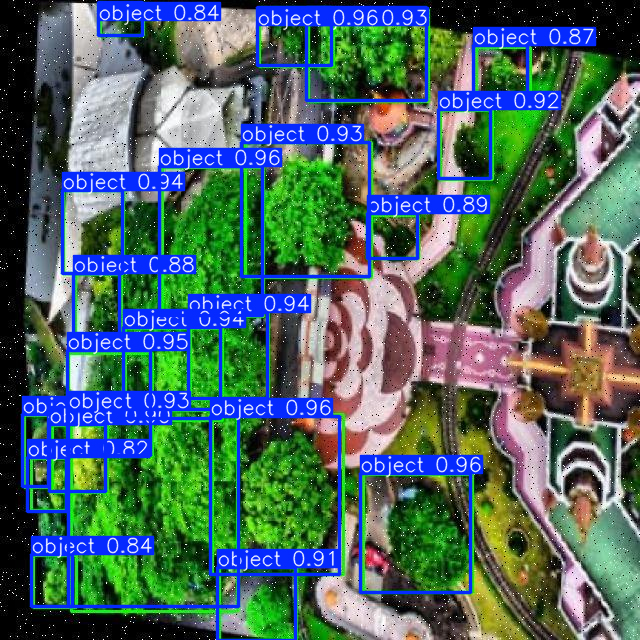

# 🚀 Satellite Imagery System 🌍  
**Welcome to the Satellite Imagery System repository!**  

---

## 📑 Project Overview  
Forests are vital for ecological balance, but deforestation, climate change, and urbanization have increased the need for efficient monitoring methods. This project leverages 🌌 satellite imagery and 🧠 artificial intelligence to detect and monitor 🌲 trees, providing an accurate, scalable, and efficient alternative to traditional methods.

---

## 🛠️ Objectives  
- 🌳 **Detect and monitor trees** using satellite imagery and AI.  
- 📏 **Efficiently assess tree cover and forest density.**  
- 📡 **Provide real-time data visualization and monitoring** via a web application.

---

## ✨ Key Features  

### 🌐 Web Application:  
- 🚀 **Real-time Data Monitoring**: Access live data on forest coverage.  
- 📊 **Dashboard Interface**: User-friendly dashboards for analysis.  
- 🗺️ **Map Integration**: Navigation and visualization of geographical data.  
- 📉 **Data Visualization**: Comprehensive visual insights from satellite imagery.  

### 🧠 AI Model:  
- 🏆 Utilizes advanced deep learning algorithms to process satellite imagery (YOLOv8).  
- 🌳 Provides accurate outputs of tree cover and density.  

---

## 🛠️ Tools & Technologies  

### ⚙️ Deep Learning Model:  
- 🌟 **YOLOv8**  
- 🖼️ **OpenCV**  
- 📊 **Matplotlib**  

### 💻 Frontend:  
- 🖌️ Web technologies for an intuitive user interface (HTML, CSS).  

### 🛠️ Backend:  
- **🌐 Flask Framework**:  
  - ✨ Lightweight and modular for flexibility.  
  - 🔗 Built-in support for RESTful APIs.  
  - 🖼️ Template integration with Jinja2 for dynamic HTML rendering.  

---

## 🗺️ Implementation Plan  

1. 📥 **Data Collection**: Gather satellite imagery data for forests.  
2. 🧠 **AI Model Training**: Develop a machine learning model for tree detection.  
3. 🌐 **Web Application Development**: Integrate the model into a Flask-based web app with real-time monitoring and dashboard features.  
4. 🌍 **Deployment**: Host the application for users to access.  

---

## 🖼️ Visual Model Summary  

Here is an example of the AI model detecting trees from satellite imagery:  

### 🖼️ Image Example  
  

---

### 🎥 Demo Video  

[📹 Watch the video](https://drive.google.com/file/d/1gBsj8EGIw8kcnAXdcxiSJk2Hm7WgZHAN/view?usp=drive_link)
